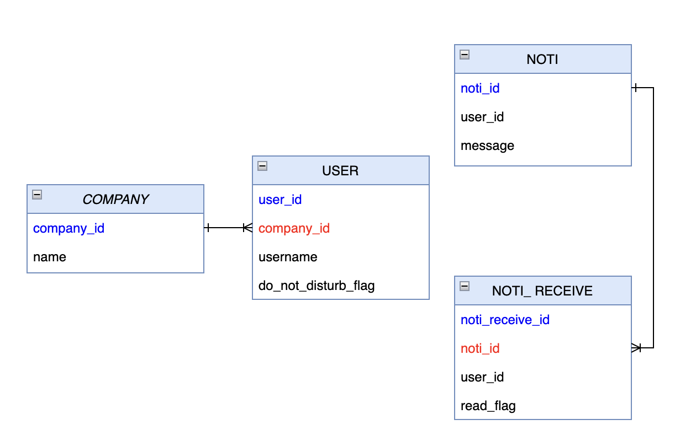

# 초간단 Notification 시스템을 통한 Querydsl 맛보기
-- --
## 요구사항
### 한 회사에 속한 유저는 해당 회사의 유저에게 Notification Message를 전송할 수 있다.

-- --
## ERD

* COMPANY : 회사 정보
* USER : 특정 회사 소속 유저 정보
* NOTI : Noti 발신자와, 메세지에 대한 정보
* NOTI_RECEIVE : Noti 수신자에 대한 정보

-- --
#### 세부사항
1. A 회사 a 직원은 A 회사 b 직원에게 **Noti를 전송할 수 있다** (O)
2. A 회사 a 직원은 **본인이 수신한 Noti 목록을 볼 수 있다** (X)
3. A 회사 a 직원은 **B 회사 a 직원에게 Noti를 전송할 수 없다** (O)
4. A 회사 직원은 **B 회사 직원을 알 수 없다** (O)
5. Noti 수신자는 **확인한 Noti와 확인하지 않은 Noti를 구분할 수 있다** (X)
6. Noti 수신자는 **복수건의 Noti를 삭제할 수 있다** (X)
7. A 회사 직원은 A 회사의 **모든 직원에게 Noti를 보낼 수 있다** (O)
8. 개별 Noti 전송은 **username을 식별**한다 (O)
9. user는 **'방해금지모드'를 설정**할 수 있으며, 방해금지 모드엔 **어떤 Noti도 수신하지 않는다** (O)
10. user가 삭제되면 해당 user가 **수신한 Noti가 삭제**된다 (X)
11. user는 Noti를 **'모두 읽음으로 처리'** 할 수 있다. (X)

-- --
## 다루지 않을 내용들
* client side의 UX/UI 적인 요소는 다루지 않는다.
* NOTI 테이블의 가비지 데이터에 대한 내용은 다루지 않는다.
* 유저의 인증에 해당하는 부분은 고려하지 않는다.